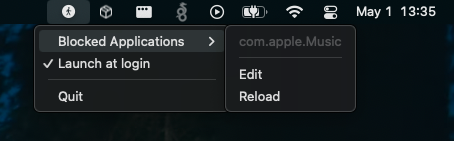

---

[](https://github.com/phkiener/homebrew-personal/blob/main/Casks/app-block.rb)
&nbsp;


---

# AppBlock

Block certain MacOS apps from launching... like that pesky Apple Music.

## Installation

Either download the latest [GitHub Release](https://github.com/phkiener/AppBlock/releases/) and extract the `.app` bundle yourself
... or use homebrew!

```sh
brew install phkiener/homebrew-personal/app-block
```

Note that the app is *not* signed, so you will need to bypass the gatekeeper. After launching for the first time (which
will be blocked), go to System Settings > Privacy and Security, you should see AppBlock mentioned at the very bottom.
